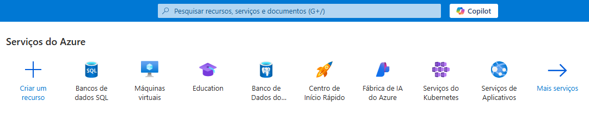
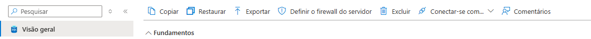

# Advanced Topics

### Como configurar o banco de dados na Azure

No painel da Azure pesquise ou clique em Banco de dados SQL




Clique em **+ Criar**


Na página de criação defina:
- Assinatura
- Grupo de recursos (Se não houver, crie)
- Nome do banco de dados
- Servidor

No momento de criar as credenciais de autenticação com o banco de dados, escolha a Autenticação SQL para definir um Usuário e Senha

Aperte em **Revisar + Criar** e por fim **Criar**

Será necessário escolher a autenticação SQL para definição do usuário e senha de login do banco

Após finalizar a criação do banco de dados, basta aguardar a implantação.



Na visão geral do banco de dados no painel Azure selecione **Definir o firewall do servidor** para habilitar sua conexão no firewall do servidor do banco de dados

Clique em Adicionar o endereço IPv4 do cliente (Seu IP)

Agora você conseguirá se conectar no banco de dados usando o SGBD ou por meio da aplicação usando as credenciais criadas anteriormente

### Como executar a aplicação

Requisitos:
- [Composer](https://getcomposer.org/download/])
- [PHP 8.2](https://www.php.net/releases/8.2/en.php)
- [Extensão Sql Server](https://github.com/microsoft/msphpsql)

```php
composer install
```

Após as instalações das dependências do projeto, será necessário configurar as variáveis de ambiente com as credenciais do banco de dados

```php
# Credenciais para conexão com o banco de dados na Azure
DB_HOST=
DB_NAME=
DB_USERNAME=
DB_PASSWORD=
```

Utilize o arquivo `database.sql` para criar a tabela no banco de dados e populá-la com os dados de exemplo

Com o .env definido basta utilizar o comando `php -S localhost:80` para iniciar o servidor e acessar a página web

### Utilizando Docker

A imagem completa está localizada no Docker Hub [daniellucas04/advanced-topics:latest](https://hub.docker.com/r/daniellucas04/advanced-topics)

Para subir um container com essa aplicação basta utilizar o comando abaixo, substituindo os valores **example** com as credenciais que desejar.

```bash
docker run -d -e DB_HOST={example} -e DB_NAME={example} -e DB_USERNAME={example} -e DB_PASSWORD={example} -p 80:80 -p 3306:3306 -v /c/database/mysql_data:/var/lib/mysql daniellucas04/advanced-topics:latest
```